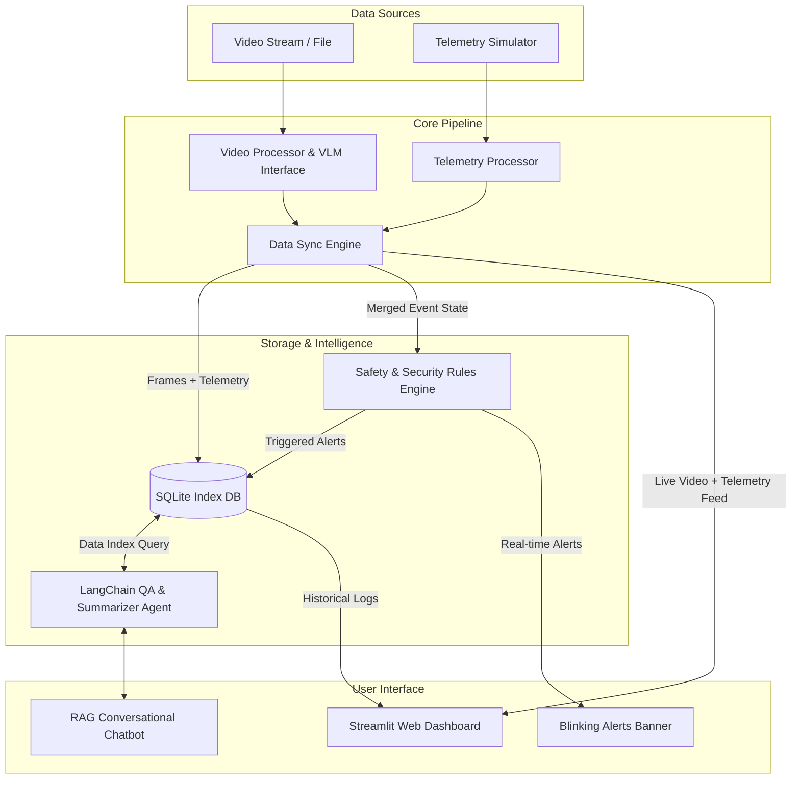
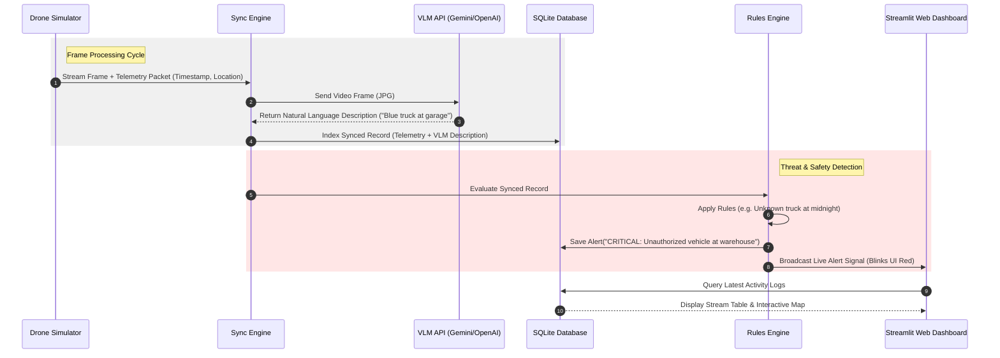

# System Architecture: Drone Security Analyst Agent

The **Drone Security Analyst Agent** is structured as an event-driven data pipeline that merges real-time telemetry with visual analytics. This document details the system design, components, database schemas, and data flow.

---

## 1. High-Level Architecture Diagram



---

## 2. Core Components

### 2.1. Telemetry Processor (`telemetry.py`)
Generates and formats real-time state metrics of the drone.
* **Outputs**: Latitude, Longitude, Altitude, Battery State, Velocity, and Contextual Location Name (e.g., "Main Gate", "South Warehouse", "Fence Line B").

### 2.2. Video Processor & VLM Interface (`video_processor.py`)
Responsible for extracting visual context.
* **Simulated Mode**: Automatically yields pre-baked high-quality visual descriptions of patrol events (designed for low-latency, zero-cost, offline evaluation).
* **Live API Mode**: Uses OpenCV to capture frames from a local video file (`.mp4`), downsamples them (e.g., 1 frame per 2 seconds), and sends them to a Vision-Language Model (Gemini or OpenAI API) to generate detailed, contextual descriptions.

### 2.3. Data Synchronization Engine (`database.py` & pipeline loop)
Joins the asynchronous telemetry packets and video frames using matching timestamps. The merged data point forms a **Synced Drone Frame** containing:
$$\text{Synced Frame} = \{\text{Timestamp}, \text{Frame Index}, \text{Visual Description}, \text{Altitude}, \text{Battery}, \text{Location Name}, \text{Coordinates}\}$$

### 2.4. Rules Engine (`rules.py`)
An automated safety and security guard. It runs on every Synced Frame, evaluating logical statements to flag critical security risks or system anomalies:
* **Rule Logic**: `if Frame.is_after_hours and Frame.contains("person") -> Trigger Intrusion Alert`
* **Rule Logic**: `if Frame.battery < 20% and Frame.altitude > 30m -> Trigger Safety Alert`

### 2.5. Storage System (`database.py`)
A lightweight, high-performance, embedded **SQLite Database**. 
* SQLite handles relational storage for historical auditing.
* We leverage SQLite's built-in **FTS5 (Full-Text Search)** extension to build the database index, allowing fast natural language text matches for objects and frame descriptions.

### 2.6. LangChain QA Agent (`agent.py`)
Coordinates RAG (Retrieval-Augmented Generation) activities:
1. **Chatbot Audit**: Security managers query the agent (e.g., *"What was the blue vehicle doing near the warehouse?"*). The agent parses the request, executes optimized SQL full-text queries against the SQLite database, retrieves matching frames + telemetry, and outputs a concise response.
2. **Video Summarizer**: Reads through all visual logs generated during a patrol and produces a concise one-sentence narrative summary of the entire flight.

---

## 3. Database Schema

The SQLite schema consists of three core tables optimized for temporal and textual querying:

### 3.1. `frames` Table
Stores indexed frame details and VLM visual logs.
```sql
CREATE TABLE IF NOT EXISTS frames (
    id INTEGER PRIMARY KEY AUTOINCREMENT,
    timestamp DATETIME NOT NULL,
    frame_index INTEGER NOT NULL,
    description TEXT NOT NULL,
    tags TEXT
);
```

### 3.2. `telemetry` Table
Stores spatial-temporal drone metrics synchronized with the frame logs.
```sql
CREATE TABLE IF NOT EXISTS telemetry (
    id INTEGER PRIMARY KEY AUTOINCREMENT,
    timestamp DATETIME NOT NULL,
    latitude REAL NOT NULL,
    longitude REAL NOT NULL,
    altitude REAL NOT NULL,
    battery INTEGER NOT NULL,
    location_name TEXT NOT NULL
);
```

### 3.3. `alerts` Table
Stores security and safety incidents generated by the Rules Engine.
```sql
CREATE TABLE IF NOT EXISTS alerts (
    id INTEGER PRIMARY KEY AUTOINCREMENT,
    timestamp DATETIME NOT NULL,
    severity TEXT NOT NULL,       -- 'CRITICAL', 'WARNING', 'INFO'
    message TEXT NOT NULL,
    rule_triggered TEXT NOT NULL
);
```

---

## 4. Execution Sequence Diagram


